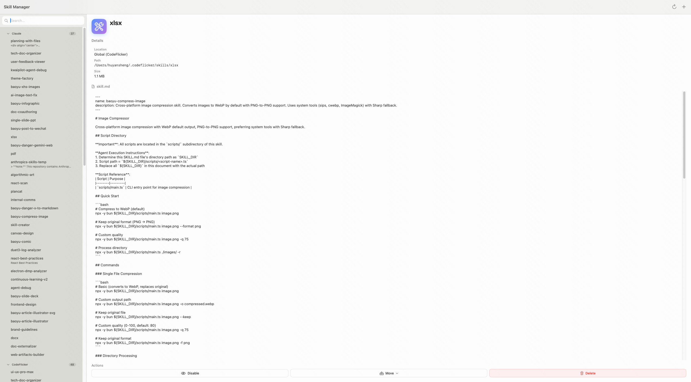

# Skill Manager

macOS 原生极简 Agent Skill 管理工具。用于管理 Claude Code / CodeFlicker 的技能，支持全局技能和工作区技能的移动管理。



## Features

- 📋 扫描全局技能目录 (`~/.claude/skills`, `~/.codeflicker/skills`)
- 🗂️ 读取 CodeFlicker/Duet 工作区数据库，展示所有工作区技能
- ↔️ 支持在全局和工作区间移动技能，避免全局污染
- 🚫 启用/禁用技能（不删除，只是重命名让 Agent 不再加载）
- 🔍 搜索筛选技能
- ℹ️ 查看技能详情（名称、描述、作者、路径、大小）
- 🗑️ 删除不需要的技能

## Requirements

- macOS 13.0+
- 开发：Xcode 14+ + Swift 5

## Installation

### via Install Script (recommended)

```bash
# Direct download and install from CDN
curl -fsSL https://h3.static.yximgs.com/kcdn/cdn-kcdn112115/manual-upload/SkillManager.zip | bash
```

Or if you have cloned the repo:
```bash
./install.sh
```

### via Homebrew Cask

The Cask formula is available in `Formula/skill-manager.rb`:

```bash
# Tap your tap then install
brew install --cask skill-manager
```

## Build from Source

```bash
git clone https://github.com/[your-username]/skill-manager.git
cd skill-manager
xcodebuild -project SkillManager/SkillManager.xcodeproj -scheme SkillManager -configuration Release clean build
# The .app will be at build/Release/SkillManager.app
# You can copy it to /Applications manually
```

## Usage

Open the app, it will automatically:
1. Scan all global skills from default paths
2. Load all workspaces from the Duet database
3. Display everything in the sidebar with search
4. Select a skill to see details and perform actions

## License

MIT
